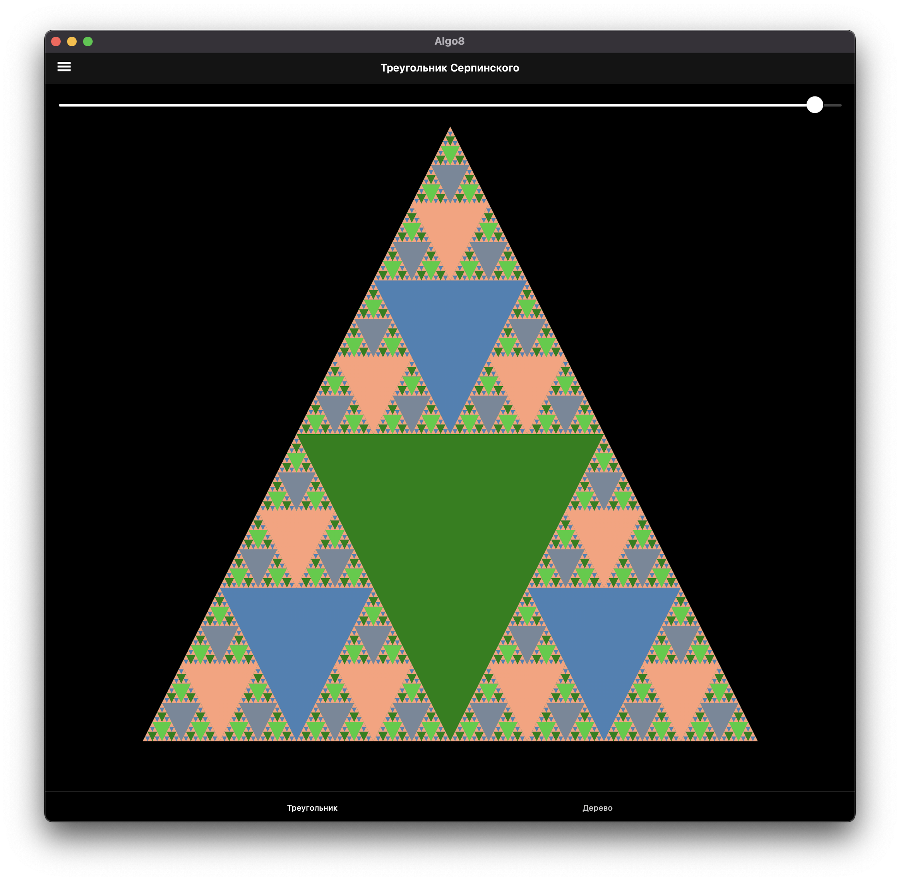
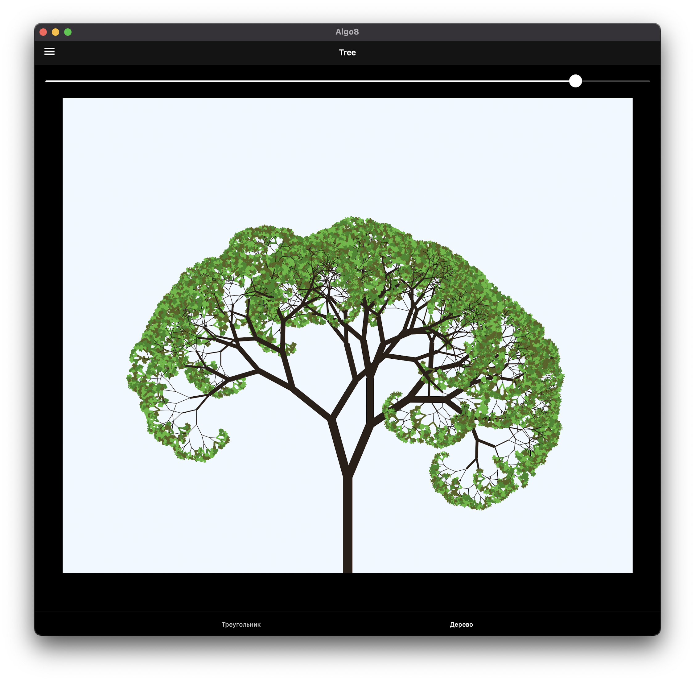

# Fractal Images

	<table>
		<tr>
			<td></td>
			<td></td>
		</tr>
	</table>

## About

An application to generate fractal images: Sierpinski Triangle and a Fractal Tree.

## Screenshots

	<table>
		<tr>
			<td></td>
			<td></td>
		</tr>
	</table>

## Implementation

The program is implemented using C# and .NET MAUI.
